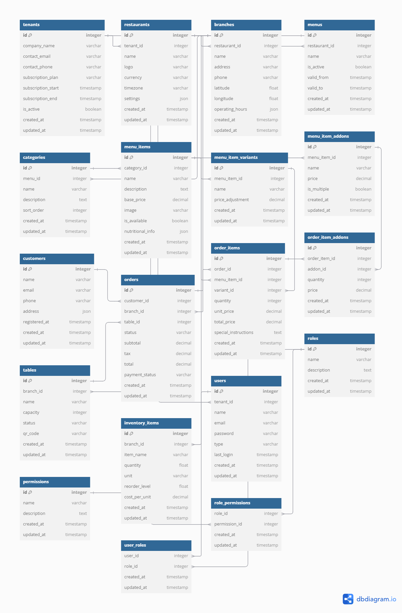
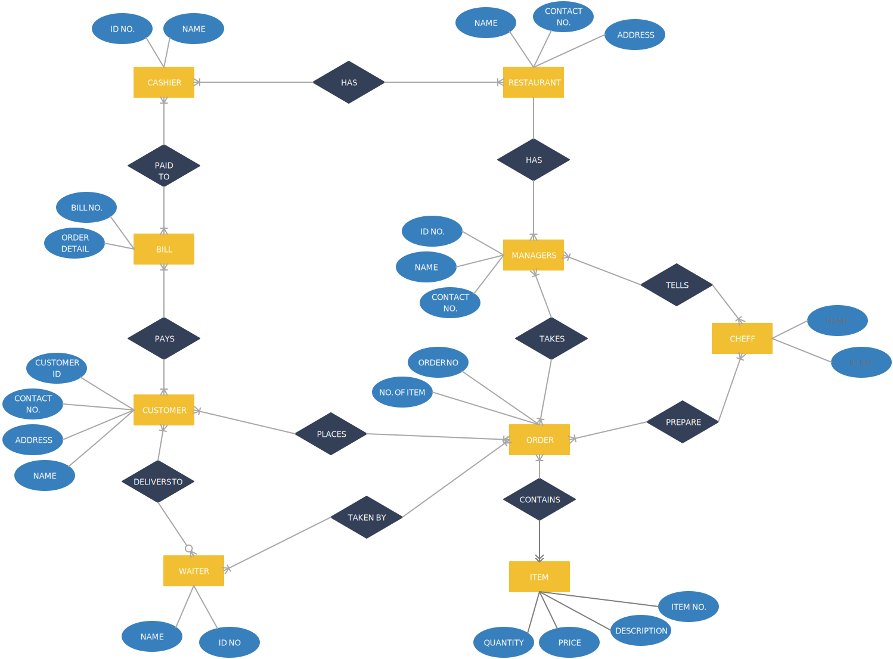

Tech stack:

`1. Laravel : ^11.0`

`2. PHP : ^8.2`

`3. Mysql: ^8.0`

To run locally (recommended for linux):

`1. sudo docker-compose build` (for the first time it will take some time to install everything.)

`2. sudo docker-compose up -d` (everytime before run this project should execute this command)

`sudo docker-compose build --no-cache` (this command will remove existing docker setup and create new instance)

To setup locally:

`create a .env file in project root directory`

`copy and paste everything from .env.example to .env`

`docker-compose exec app bash`

`composer install`

To run migrations:

`1. docker-compose exec app bash`

`2. php artisan config:clear`

`3. php artisan migrate`

`3. php artisan db:seed`

To run unit test:

`1. docker-compose exec app bash`

`2. vendor/bin/phpunit`

Schema hints diagram

Schema design

https://dbdiagram.io/d/6624910103593b6b61872f2a

Todo
1. Add expire date to purchase product
2. Handle payment status to purchase product
3. 
