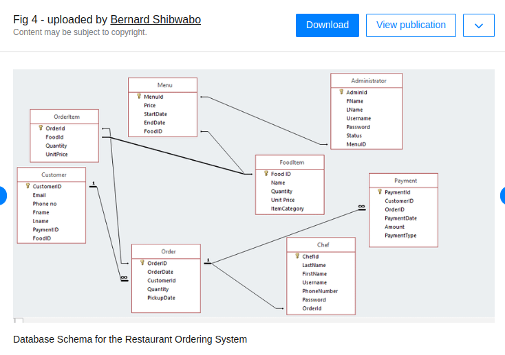

Tech stack:

`1. Laravel : ^11.0`

`2. PHP : ^8.2`

`3. Mysql: ^8.0`

To setup locally:

`create a .env file in project root directory`

`copy and paste everything from .env.example to .env`

`composer install`

`php artisan config:clear`

To run locally:

`docker-compose up` (for the first time it will take some time to install everything.)

To run migrations:

`1. docker-compose exec app bash`

`2. php artisan migrate`

To run unit test:

`1. docker-compose exec app bash`

`2. vendor/bin/phpunit`

Schema hints diagram

